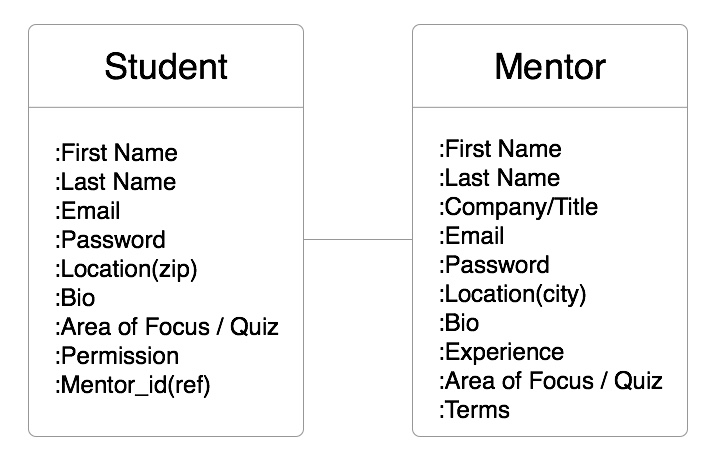
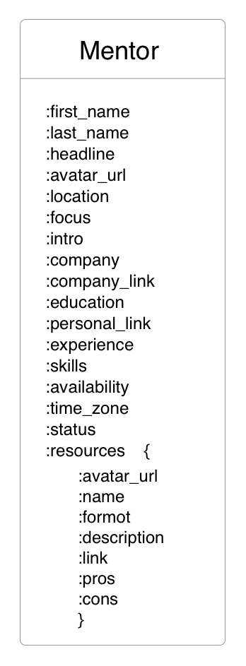
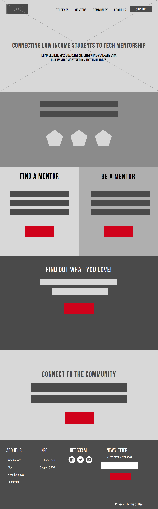
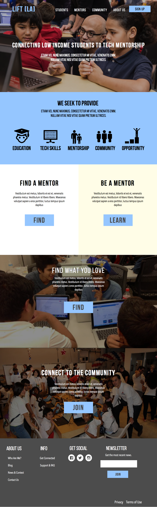

# mentor(student)

Our project aims to connect  students to tech mentors.

If you fork this repo, you must run `npm install` in order for the app to function properly.

[Visit mentor(student) on Heroku](http://mighty-waters-89234.herokuapp.com/)

-

### Technologies Used

* Node.js

* Express

* MongoDB

* Passport.js

* AWS

* Node Mailer

* Bootstrap

* Adobe Creative Cloud

-

#### User Stories

| As a .. | I can.. | route |
|---------|---------|---------|
| Visitor | learn about the site | ( '/about' ) |
| Visitor | take a quiz | ( '/quiz' ) |
| Visitor | browse mentors | ( '/mentors' ) |
| Visitor | filter mentors | ( '/mentors' ) |
| Visitor | sort mentors | ( '/mentors' ) |
| Visitor | search mentors | ( '/mentors' ) |
| Visitor | contact a mentor through their particular email request form |
| Visitor | access resources | ( '/resources' ) |
| Mentor | create/edit/delete my public profile |
| Mentor | create/edit/delete my resources |
| Mentor | create/edit/delete other mentor's resources |
| Mentor | update my status from availible to unavailible |
| Mentor | recieve emails from interested visitor |
-

#### ERD



##### Student Model
``` email, password, first_name, last_name, location, area_of_focus, bio, website, parental_consent ```

##### Mentor Model
``` email, password, first_name, last_name, headline, location, area_of_expertise, bio, personal_website, compary_website, experiences, skills, availibility, status, terms ```
 


##### Mentor Model
``` local: { email: String, password: String }, first_name: String, last_name: String, headline: String, avatar_url: String, location: String, focus: String, intro: String, company: String, company_link: String, education: String, personal_link: String, experience: String, skills: [], availibility: String, time_zone: String, status: Boolean, resources: [ResourceSchema] ```

##### Resource Model
``` avatar_url: String, name: String, format: String, description: String, link: String, pros: String, cons: String  ```

-

#### Wireframes



